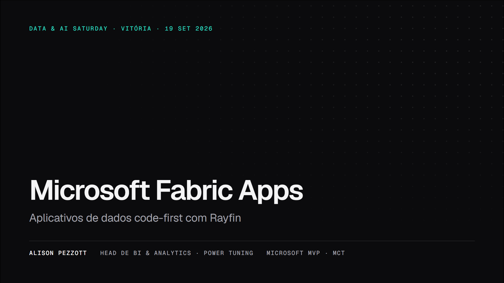
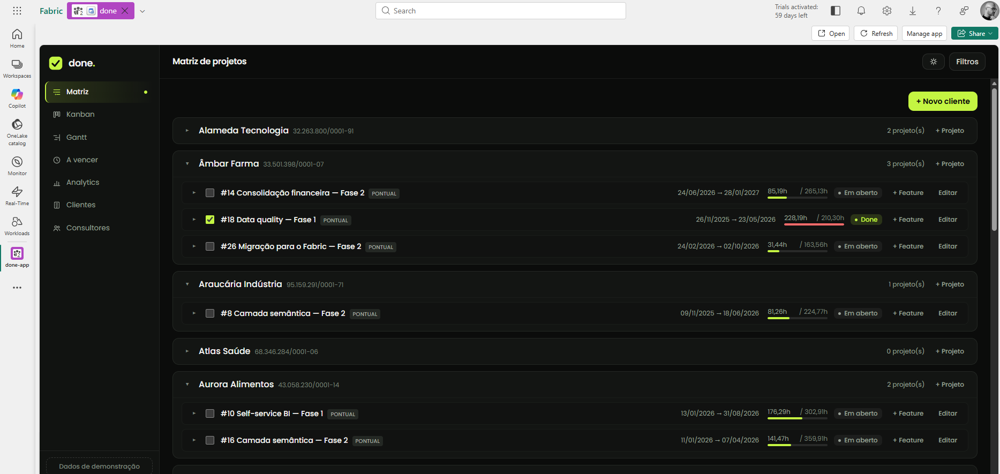
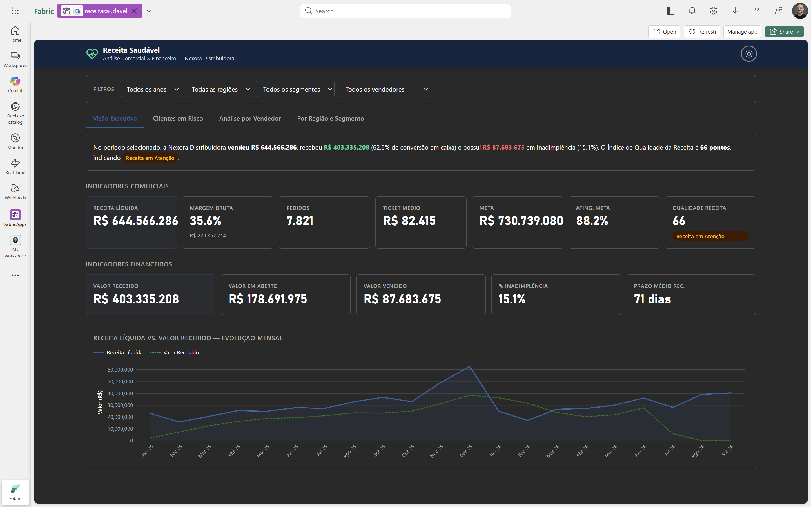

# Microsoft Fabric Apps: aplicativos de dados code-first com Rayfin

Palestra de 50 minutos no **Data & AI Saturday Vitória 2026**, na UniSales, em
19 de setembro de 2026, por [Alison Pezzott](https://www.linkedin.com/in/alisonpezzott).
Este repositório tem o deck completo, com as notas de apresentador de cada slide.

**Deck online:** <https://data-saturday-vix-2026.alisonpezzott.com.br>, publicado logo após a palestra.

## A palestra em um parágrafo

O report mostra o número. A ação acontece fora dele: no Power Apps, num web app
próprio ou na planilha paralela, e o dado operacional nasce fora da governança do
Fabric. E se o app fosse um **item do workspace**, como um Lakehouse ou um report?
É o que o **Fabric Apps**, em preview desde a Build 2026, faz junto com o
**Rayfin**, o SDK e CLI open source da Microsoft: uma classe TypeScript vira
tabela, API e client tipado num item com banco, autenticação e hosting; e o
modelo semântico que o time de BI já governa vira o backend de um app, sem
segunda cópia do dado e sem segundo modelo de segurança.

## O que você leva

1. **Fabric Apps é backend as a service** dentro do Fabric; Rayfin é o SDK open source que o declara em código.
2. **Duas formas de app**: o app dono do dado, com entities, ou leitor do modelo, com DAX. A híbrida fecha o ciclo do planejamento: lê o que o BI governa, grava o plano, e o plano volta ao modelo sem ETL.
3. **O modelo semântico continua sendo a única fonte de cálculo**; o app é apresentação. O modelo fica mais simples quando a camada visual vira código.
4. **O repositório ensina o agente**: skills, MCP e documentação travada na versão instalada.
5. **Preview honesto**: 19 regiões e Brazil South ainda não, SSO exclusivo, CU no SQL e na GraphQL, GA prevista para o fim de 2026.

## Roteiro

1. A plataforma: Rayfin × Fabric Apps, os três serviços filhos, o que acontece num `rayfin up`, pré-requisitos e regiões
2. Duas formas de app, e a forma híbrida
3. Code-first: da classe à tabela, permissão declarada na entity, evolução de schema como deploy, do zero ao deploy em cinco comandos
4. O modelo semântico como backend: do alias ao hook, DAX composta de medidas do modelo, dois modelos numa tela, só dentro do portal
5. Demo, sem rede: os dois apps abaixo, capturados no portal, e o que a demo prova de ganho e de custo
6. Feito para agentes: o loop que funciona
7. Deploy, custo e governança: o que consome CU, SSO, CI/CD com service principal, dev e prod
8. O que mudou desde o preview de junho, e para onde vai
9. Quando um app vale a pena: cinco perguntas, dois minutos

## Os dois apps da demo

Os dois são públicos, rodam como item do workspace e só carregam dado sintético.

| Done, o app dono do dado | Receita Saudável, o app que lê dois modelos |
| :--- | :--- |
|  |  |
| Gestão de projetos de dados: entities em TypeScript viram SQL database, GraphQL e client tipado; as regras de negócio são código versionado, não trigger. Código e deck da palestra anterior em [microsoft-fabric-apps-aplicativos-de-dados-code-first-com-rayfin](https://github.com/alisonpezzott/microsoft-fabric-apps-aplicativos-de-dados-code-first-com-rayfin). | Cruza um modelo Comercial e um Financeiro, em workspaces diferentes, com DAX composta das medidas que já existem, para responder se a empresa está vendendo mais ou vendendo melhor. Código, modelos `.pbip` em TMDL e dados sintéticos em [fabric-app-receita-saudavel](https://github.com/alisonpezzott/fabric-app-receita-saudavel). |

## Assista, acompanhe, conversa

- **YouTube**: [Criei um Fabric App com 2 Modelos Semânticos usando Rayfin](https://youtu.be/0oec-1s-T_Y) mostra o Receita Saudável em funcionamento. Os outros vídeos sobre Fabric, Power BI e Rayfin estão no canal [@alisonpezzott](https://www.youtube.com/@alisonpezzott).
- **LinkedIn**: [linkedin.com/in/alisonpezzott](https://www.linkedin.com/in/alisonpezzott) é onde eu compartilho o que sai desta palestra e das próximas. Me conta lá o que você construiu com Rayfin.
- **Palestra anterior** sobre o tema, com o Done demonstrado ao vivo: [mvp-conf-regional-2026.alisonpezzott.com.br](https://mvp-conf-regional-2026.alisonpezzott.com.br).
- Se o material ajudou, uma estrela neste repositório ajuda mais gente a encontrá-lo.

## Rodar o deck localmente

```bash
npm install
npm run dev
```

Abre em `http://localhost:3030`. As notas de apresentador de cada slide ficam no
Markdown em `slides/`. Comandos de exportação, estrutura do projeto e roteiro
com tempos estão em [docs/development.md](docs/development.md).

## Fontes primárias

- [What is Fabric Apps (preview)?](https://learn.microsoft.com/fabric/apps/overview) e o restante da seção `fabric/apps` no Microsoft Learn
- [Fabric region availability](https://learn.microsoft.com/fabric/admin/region-availability)
- [microsoft/rayfin](https://github.com/microsoft/rayfin) · [awesome-rayfin](https://github.com/microsoft/awesome-rayfin) · npm `@microsoft/rayfin-cli` e `@microsoft/fabric-app-data`
- Blog do Fabric: *Introducing Rayfin*, *Rayfin AMA: your top questions answered*, *Beyond markdown: shareable sites with Rayfin*
- Fabric Insider ep. 11 com Sachin Patney, The New Stack e Azure Blog sobre a Build 2026, Tabular Editor sobre data apps e modelos semânticos

## Quem fala

**Alison Pezzott** é Head de BI & Analytics na [Power Tuning](https://powertuning.com.br),
Microsoft MVP em Data Platform e MCT. Missão: democratizar o conhecimento em
Microsoft Fabric e Power BI com simplicidade, profundidade e didática, a partir de
soluções reais. Mais em [alisonpezzott.com.br](https://alisonpezzott.com.br) e no
[GitHub](https://github.com/alisonpezzott).
