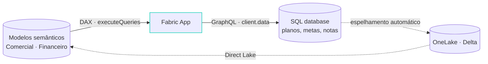

###### 02 · Duas formas de app

# Duas formas de app, um só CLI

  

    <h4><carbon-db2-database />O app é <em>dono</em> do dado</h4>
    
data.enabled: truedialect: mssql

    <ul>
      <li>Entities em <code>rayfin/data/*.ts</code>: SQL DB + GraphQL + client tipado</li>
      <li>Dado que <strong>nasce no app</strong>: formulários, filas, planos, estado de agente</li>
    </ul>
    
o Done

  

  
ou

  

    <h4><carbon-chart-line />O app <em>lê</em> o estado analítico</h4>
    
data.enabled: falsetemplate dataapp

    <ul>
      <li>Nenhum banco: <strong>DAX</strong> nos modelos que o BI já governa</li>
      <li>Sem segunda cópia, sem segundo modelo de segurança: a <strong>RLS do modelo</strong> vale</li>
    </ul>
    
o Receita Saudável

  

A fronteira não é técnica: é operacional × analítico. Misturar as duas, quando o processo pede, é legítimo.

<!--
Alvo: 00:11.
Esta é a decisão nº 1 de qualquer projeto de Fabric App, e o rayfin.yml registra a
escolha numa linha: data.enabled. Esquerda: o Done. Direita: o Receita Saudável.
No yml: data.enabled: true com dialeto mssql (hoje só SQL Server no Fabric);
auth.fabric.enabled: true é obrigatório para deployar, sem auth o up recusa. No data
app, data.enabled: false: nenhum SQL database é provisionado e o custo em CU cai
junto; o buildCommand regenera o fabric.generated.ts antes do Vite, editar o
fabric.yaml sem rebuild não muda nada. Toda string aceita ${VAR} e ${VAR:-default}
resolvidos de rayfin/.env.
A frase de baixo é a que vale anotar: não é "com banco ou sem banco"; é "quem é
dono desse dado?". Se o BI já governa, o app lê. Se o processo cria, o app é dono.
-->

---

# A forma híbrida: lê o modelo, grava o *plano*

Lê o que o BI governa, grava o que o processo cria, e o que gravou volta ao modelo <strong>sem ETL</strong>: o SQL database in Fabric já vive no OneLake.

<!--
Alvo: 00:13.
É o desenho que responde ao "planejamento" do título: o time vê a receita por
cliente (modelo), define o plano de cobrança (entity do app), e o plano aparece
no próprio modelo na próxima frame do Direct Lake.
Nenhuma segunda cópia da receita; nenhuma planilha paralela. É exatamente o buraco
do primeiro slide fechado dentro da plataforma.
-->
