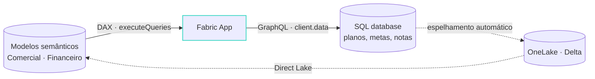

# Duas formas de app, um só CLI

::left::

#### O app é *dono* do dado

- `services.data.enabled: true`
- Entities em `rayfin/data/*.ts` viram SQL DB + GraphQL + client tipado
- Para o dado operacional que **não existia** antes do app: formulários, filas, planos, estado de agente

::right::

#### O app *lê* o estado analítico

- Template `dataapp` · `data.enabled: false`
- Nenhum banco: **DAX** contra modelos semânticos que já existem
- Sem segunda cópia do dado e sem segundo modelo de segurança: a **RLS do modelo** continua valendo

::bottom::

A fronteira não é técnica. É a fronteira entre operacional e analítico — e misturar as duas, quando o processo pede, é legítimo.

<!--
Alvo: 00:10:30.
Esta é a decisão nº 1 de qualquer projeto de Fabric App, e o `rayfin.yml` registra
a escolha. Esquerda: o Done. Direita: o Receita Saudável.
A frase de baixo é a que vale anotar: não é "com banco ou sem banco"; é "quem é
dono desse dado?". Se o BI já governa, o app lê. Se o processo cria, o app é dono.
-->

---
layout: two-cols-header
---

# O `rayfin.yml` registra a escolha

::left::

#### Entity-backed

<<< @/snippets/rayfin-entity.yml yaml {5-7|8-11|all}{lines:false}

::right::

#### Data app

<<< @/snippets/rayfin-dataapp.yml yaml {5-6|11-15|all}{lines:false}

<!--
Alvo: 00:12.
Mesmo arquivo, mesma estrutura, uma linha decide.
[click] `data.enabled: true` com dialeto mssql — hoje só SQL Server no Fabric.
[click] `fabric.enabled: true` é obrigatório para deployar: sem auth o `up` recusa.
[click] No data app, `data.enabled: false`: nenhum SQL database é provisionado, e o
custo em CU cai junto.
[click] O `buildCommand` do data app regenera o `fabric.generated.ts` antes do Vite —
editar o `fabric.yaml` sem rebuild não muda nada.
Toda string aceita `${VAR}` e `${VAR:-default}` resolvidos de `rayfin/.env`.
-->

---

# A forma híbrida: lê o modelo, grava o *plano*

- O app **lê** o que o BI governa e **grava** o que o processo cria
- O que gravou volta ao modelo **sem ETL**: o SQL database in Fabric já vive no OneLake

<!--
Alvo: 00:13:30.
É o desenho que responde ao "planejamento" do título: o time vê a receita por
cliente (modelo), define o plano de cobrança (entity do app), e o plano aparece
no próprio modelo na próxima frame do Direct Lake.
Nenhuma segunda cópia da receita; nenhuma planilha paralela. É exatamente o buraco
do slide 3 fechado dentro da plataforma.
-->
