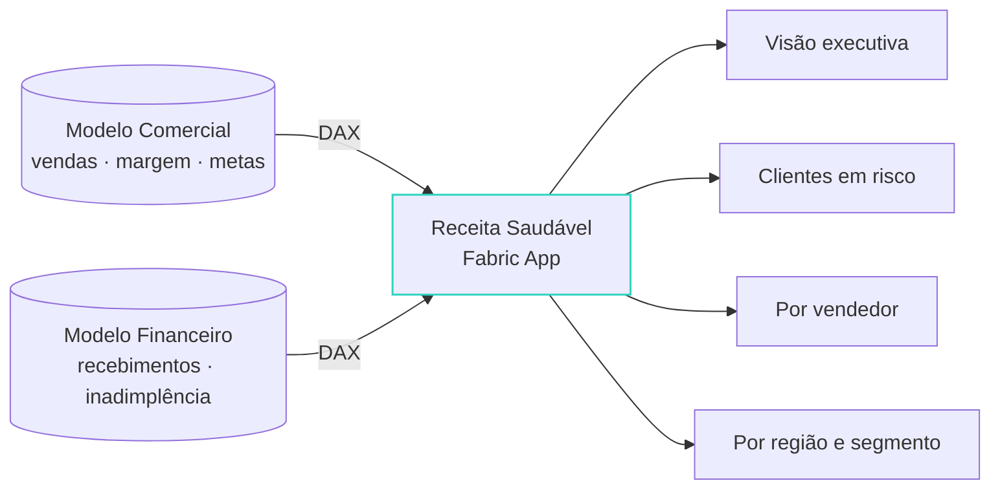

###### 03

# O modelo semântico como *backend*

O template `dataapp`: nenhum banco, DAX contra os modelos que o time de BI já governa.

03

<!--
Alvo: 00:22:30.
Aqui a palestra encontra o título: "transformar modelos semânticos em experiências
interativas". Tudo desta seção é o Receita Saudável, código público.
-->

---

# `fabric.yaml`: um alias por modelo

<<< @/snippets/fabric.yaml yaml {5-7|8-10|1|all}{lines:false}

<v-click>

Dois modelos, dois aliases: o app cruza **workspaces** e **modelos** como uma página de report nunca pôde.

</v-click>

<!--
Alvo: 00:23.
[click] Cada alias aponta para `{ workspaceId, itemId }` de um modelo semântico.
[click] O segundo modelo pode estar em OUTRO workspace — é o caso do Receita Saudável:
Comercial e Financeiro em workspaces separados, app num terceiro.
[click] Perfis (`activeProfile`) permitem dev e prod apontarem para modelos diferentes.
[click] Isto é o que um report não faz: uma página, dois modelos, sem composite model.
-->

---

# Do alias ao *hook*, em quatro passos

<v-clicks>

1. `fabric.yaml` declara os aliases por perfil
2. `npx fabric-app-data generate -o src/fabric.generated.ts` gera a config tipada — no `buildCommand`, sempre
3. `FabricClient` com `EmbedFabricApiProxy`: a query DAX viaja por `postMessage` até o host do Fabric
4. `useSemanticModelQuery({ connection, query })` na tela; cache LRU; resultado em **Arrow** ou JSON

</v-clicks>

<!--
Alvo: 00:24.
[click] O yaml é a única fonte dos IDs.
[click] Se você editar o yaml e não rodar o generate, nada muda — por isso o template
o coloca no build.
[click] O proxy é o segredo do "só funciona dentro do portal": quem executa a DAX é
o host do Fabric, com o token do usuário, via Execute Queries API. O app nunca vê
token nenhum.
[click] `daxProtocol: 'arrow'` é novidade da versão 1.1 do SDK (julho): colunar,
menos bytes, menos parse. E o contrato do proxy já define `executeSql` para
Lakehouse e Warehouse — ainda não exposto no client, mas o desenho está lá.
-->

---

# O client, uma vez

<<< @/snippets/fabric-client.ts#client ts {1-5|6-10|all}{lines:true}

<!--
Alvo: 00:25.
[click] Singleton: o cache LRU vive aqui. O message client é quem fala com o iframe
do portal.
[click] O proxy embed recebe o message client; `fabricConfig` vem do arquivo gerado;
`daxProtocol` escolhe Arrow ou JSON. Tudo o resto é React normal.
-->

---

# `useSemanticModelQuery`

<<< @/snippets/use-semantic-model-query.ts#hook ts {1-4|5-12|13-14|all}{lines:true}

<!--
Alvo: 00:25:30.
[click] Entrada: alias + DAX. Saída: `data`, `isLoading`, `refetch`.
[click] O SDK NUNCA lança: o resultado volta com `status: 'success' | 'error'`. Quem
vem de fetch tenta o try/catch e não entende por que o erro não aparece.
`bypassCache` força a ida ao modelo mas ainda grava o cache.
[click] Executa no mount e quando a query muda — filtro mudou, DAX mudou, requery.
-->

---

# A DAX é composta de *medidas* do modelo

<<< @/snippets/dax-query.ts#dax ts {1-3|5-16|all}{lines:true}

<!--
Alvo: 00:27.
[click] Toda string que vem da UI passa por escape antes de entrar no filtro —
aspas duplas dobradas. Injeção de DAX existe.
[click] SUMMARIZECOLUMNS sobre colunas de dimensão e MEDIDAS do modelo: [Receita
Líquida], [% Margem Bruta]. O app é apresentação; o cálculo mora no modelo,
certificado, com RLS. Reconstruir medida em TypeScript é o anti-padrão nº 1 —
e depois vem a reunião do "por que os números não batem".
[click] O template organiza isso como `.dax` + `.json` (Vega-Lite) + `.ts` por
visual — o agente lê e escreve nesse formato.
-->

---

# Dois modelos, uma *tela*

A empresa está **vendendo mais** — ou **vendendo melhor**? O cruzamento acontece no client, por `ClienteId`.

<!--
Alvo: 00:28:30.
Comercial mede quanto vende; Financeiro mede quanto vira caixa. Nenhum dos dois
modelos responde sozinho à pergunta; o app cruza os resultados das duas DAX pelo
ClienteId e calcula o score de risco na tela.
É o caso que justifica o formato: dois times de BI, dois modelos governados, uma
pergunta executiva nova — sem composite model, sem novo dataset, sem cópia.
-->

---

# Só *dentro* do portal — por enquanto

<<< @/snippets/embedded-auth.ts#embedded ts {1-2|3-8|10|all}{lines:true}

<!--
Alvo: 00:30.
[click] Dentro do iframe do Fabric a sessão chega por postMessage: sem popup, sem
gesto do usuário, seguro no carregamento da página.
[click] PKCE S256, nonce de estado, validação de `event.origin` em toda mensagem,
timeout de 5 minutos. `returnOrigin` é origem pura, sem path.
[click] Fora do iframe `initEmbeddedAuth` devolve null — e o app mostra o aviso
"abra pelo Fabric", não um erro. Limitação documentada: o botão Open do portal, que
abre em aba própria, faz as queries falharem. A doc chama de temporária.
Fora do data app existe o fluxo popup (`ensureSignedInWithFabric`), que precisa de
clique do usuário — senão o navegador bloqueia.
-->

---
layout: two-cols-header
---

# O que o template `dataapp` traz de fábrica

::left::

#### Primitivas

- Visuais **Vega-Lite** com cross-highlight: barras, linhas, área, scatter, donut, heatmap, waterfall, cards
- **Data grid** com formatação por coluna, ordenação, data bars, células compostas
- **Format strings** e tema definidos uma vez, aplicados em eixo, tooltip, label e grid

::right::

#### Para o agente

- `AGENTS.md` com o contrato do projeto e dez skills em `.agents/skills/`
- Convenção `.dax` + `.json` + `.ts` por visual
- Validação **Playwright** antes do deploy: renderizou, não cortou, sem erro no console

<!--
Alvo: 00:31:30.
A tese da Microsoft na doc do template: sem essas primitivas, todo agente teria que
resolver auth, DAX e visualização do zero em cada sessão — e falharia mais.
Esquerda: `@microsoft/fabric-visuals` e `@microsoft/fabric-datagrid`, versão 1.1.
Direita: o que muda o jeito de trabalhar. Você não abre o Copilot num repo vazio;
abre num repo que já ensina o agente a se comportar.
-->

---

# O modelo semântico fica *mais simples*

<v-clicks>

- Sai do modelo o que só existia para o report: field parameters, medidas de cor, SVG, format strings dinâmicas, tabelas de tradução
- Fica o que é negócio: **medidas certificadas**, nomes limpos, relacionamentos, **RLS**
- Formatação, filtro e interação passam a ser **código do app**, com teste e code review
- Um modelo assim serve report, app, task flow e agente ao mesmo tempo

</v-clicks>

Argumento de "How Data Apps make semantic models better in Fabric" e "Fabric Apps explained: visualization as code", Tabular Editor, jun–ago 2026. "Se o report é LEGO, o data app é impressora 3D."

<!--
Alvo: 00:33.
Este slide é para o modelador de dados na plateia. A analogia LEGO × impressora 3D é
da Tabular Editor — creditar em voz alta.
O efeito colateral positivo: quando a camada visual vira código, o modelo volta a ser
só modelo. E o mesmo modelo agora tem quatro consumidores — Power BI, Fabric App,
translytical task flow e agente via DAX — então cada medida ruim custa quatro vezes.
-->
