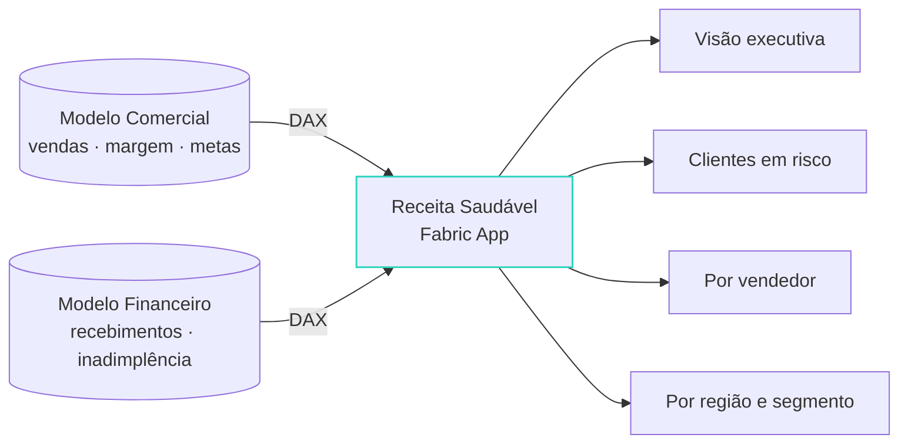

###### 04 · O modelo semântico como backend

# Do alias ao *hook*, em quatro passos

  

    <carbon-document />
    <strong><code>fabric.yaml</code></strong>
    <small>um alias por modelo: <code>workspaceId</code> + <code>itemId</code>, por perfil</small>
  

  

  

    <carbon-terminal />
    <strong><code>fabric-app-data generate</code></strong>
    <small>gera <code>fabric.generated.ts</code>; roda no <code>buildCommand</code>, sempre</small>
  

  

  

    <carbon-api-1 />
    <strong><code>EmbedFabricApiProxy</code></strong>
    <small>o <code>FabricClient</code> manda a DAX por postMessage ao host do Fabric; o app nunca vê token</small>
  

  

  

    <carbon-chart-cluster-bar />
    <strong><code>useSemanticModelQuery</code></strong>
    <small>cache LRU · resultado em Arrow ou JSON · nunca lança</small>
  

Dois modelos, dois aliases, workspaces diferentes: o app cruza o que uma página de report nunca pôde.

<!--
Alvo: 00:23.
Aqui a palestra encontra o título: "transformar modelos semânticos em experiências
interativas". Tudo desta seção é o Receita Saudável, código público.
O yaml é a única fonte dos IDs: cada alias aponta para { workspaceId, itemId } de um
modelo semântico, e o segundo modelo pode estar em OUTRO workspace, que é o caso do
Receita Saudável: Comercial e Financeiro em workspaces separados, app num terceiro.
Perfis (activeProfile) permitem dev e prod apontarem para modelos diferentes.
[click] Se você editar o yaml e não rodar o generate, nada muda; por isso o template
o coloca no build.
[click] O proxy é o segredo do "só funciona dentro do portal": quem executa a DAX é
o host do Fabric, com o token do usuário, via Execute Queries API. O app nunca vê
token nenhum. O client é um singleton, o cache LRU vive nele; daxProtocol: 'arrow'
é novidade da versão 1.1 do SDK (julho): colunar, menos bytes, menos parse. O
contrato do proxy já define executeSql para Lakehouse e Warehouse, ainda não
exposto no client, mas o desenho está lá.
[click] O hook: entrada alias + DAX, saída data, isLoading, refetch. O SDK NUNCA
lança: o resultado volta com status 'success' | 'error'. Quem vem de fetch tenta o
try/catch e não entende por que o erro não aparece. bypassCache força a ida ao
modelo mas ainda grava o cache. Executa no mount e quando a query muda.
-->

---

# A DAX é composta de *medidas* do modelo

<<< @/snippets/dax-query.ts#dax ts {1-3|5-16|all}{lines:true}

<!--
Alvo: 00:25:30.
[click] Toda string que vem da UI passa por escape antes de entrar no filtro,
aspas duplas dobradas. Injeção de DAX existe.
[click] SUMMARIZECOLUMNS sobre colunas de dimensão e MEDIDAS do modelo: [Receita
Líquida], [% Margem Bruta]. O app é apresentação; o cálculo mora no modelo,
certificado, com RLS. Reconstruir medida em TypeScript é o anti-padrão nº 1, e
depois vem a reunião do "por que os números não batem".
[click] O template organiza isso como .dax + .json (Vega-Lite) + .ts por visual; o
agente lê e escreve nesse formato.
-->

---

# Dois modelos, uma *tela*

A empresa está <strong>vendendo mais</strong>, ou <strong>vendendo melhor</strong>? O cruzamento acontece no client, por <code>ClienteId</code>.

<!--
Alvo: 00:27:30.
Comercial mede quanto vende; Financeiro mede quanto vira caixa. Nenhum dos dois
modelos responde sozinho à pergunta; o app cruza os resultados das duas DAX pelo
ClienteId e calcula o score de risco na tela.
É o caso que justifica o formato: dois times de BI, dois modelos governados, uma
pergunta executiva nova, sem composite model, sem novo dataset, sem cópia.
-->

---

# Só *dentro* do portal, por enquanto

  

    Portal do Fabric · o host
    

      

        <carbon-user-avatar />
        <strong>Sessão do usuário</strong>
        <small>o token fica no host</small>
      

      

      

        <carbon-cloud-app />
        <strong>Fabric App · iframe</strong>
        <small><code>initEmbeddedAuth</code>: sem popup, sem gesto, PKCE S256, origin checada em toda mensagem</small>
      

    

  

  

    <carbon-launch />
    <strong>Aba própria</strong>
    <small>o botão Open do portal: <code>initEmbeddedAuth</code> devolve <code>null</code> e o app diz "abra pelo Fabric". Aviso, não erro.</small>
  

Limitação documentada como temporária. Fora do data app existe o fluxo popup, que exige clique do usuário.

<!--
Alvo: 00:29.
Dentro do iframe do Fabric (?fabricEmbedded=true) a sessão chega por postMessage:
sem popup, sem gesto do usuário, seguro no carregamento da página. PKCE S256, nonce
de estado, validação de event.origin em toda mensagem, timeout de 5 minutos;
returnOrigin é origem pura, sem path.
Fora do iframe initEmbeddedAuth devolve null, e o app mostra o aviso "abra pelo
Fabric", não um erro. Limitação documentada: o botão Open do portal, que abre em
aba própria, faz as queries falharem. A doc chama de temporária.
Fora do data app existe o fluxo popup (ensureSignedInWithFabric), que precisa de
clique do usuário; senão o navegador bloqueia.
-->

---

# O modelo semântico fica *mais simples*

  

    <h4><carbon-certificate />Fica no modelo</h4>
    <ul class="check">
      <li>medidas certificadas</li>
      <li>nomes limpos e relacionamentos</li>
      <li>RLS</li>
    </ul>
    
o que é negócio

  

  

    <h4><carbon-subtract />Sai do modelo</h4>
    <ul class="minus">
      <li>field parameters</li>
      <li>medidas de cor e SVG</li>
      <li>format strings dinâmicas</li>
      <li>tabelas de tradução</li>
    </ul>
    
o que só existia para o report

  

  

    <h4><carbon-code />Vira código do app</h4>
    <ul class="plus">
      <li>formatação e tema</li>
      <li>filtro e interação</li>
      <li>teste e code review</li>
    </ul>
    
com PR, como o resto

  

  um modelo, quatro consumidores
  <carbon-dashboard />report
  <carbon-cloud-app />Fabric App
  <carbon-touch-1 />translytical task flow
  <carbon-bot />agente via DAX

Argumento de "How Data Apps make semantic models better in Fabric" e "Fabric Apps explained: visualization as code", Tabular Editor, jun–ago 2026. "Se o report é LEGO, o data app é impressora 3D."

<!--
Alvo: 00:31.
Este slide é para o modelador de dados na plateia. A analogia LEGO × impressora 3D é
da Tabular Editor; creditar em voz alta.
O efeito colateral positivo: quando a camada visual vira código, o modelo volta a ser
só modelo. E o mesmo modelo agora tem quatro consumidores (Power BI, Fabric App,
translytical task flow e agente via DAX), então cada medida ruim custa quatro vezes.
O que o template dataapp traz de fábrica para essa camada visual: visuais Vega-Lite
com cross-highlight (barras, linhas, área, scatter, donut, heatmap, waterfall,
cards), data grid com formatação por coluna, ordenação e data bars, format strings e
tema definidos uma vez (@microsoft/fabric-visuals e @microsoft/fabric-datagrid 1.1).
-->
