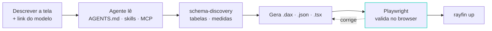

###### 06 · Feito para agentes

# O repositório ensina o *agente*

  <carbon-document />AGENTS.md: o contrato do app
  <carbon-folder />.agents/skills/: dez skills, na versão instalada
  <carbon-api-1 />.mcp.json: Rayfin MCP, a doc da versão certa
  <carbon-terminal />npx rayfin docs search
  <carbon-chart-bar />Vega-Lite + data grid de fábrica
  <carbon-bot />plugin v0.4: Claude Code · Copilot CLI · Codex · Cursor · Gemini CLI · Kimi · VS Code

Humano decide <strong>o quê</strong> e revisa o PR; o agente monta <strong>como</strong>, contra a doc da versão instalada.

<!--
Alvo: 00:38:30.
O Rayfin foi desenhado para ser lido e escrito por Copilot, Claude Code e afins,
não só por pessoas. A doc do template recomenda exatamente este loop: "use meu
modelo em <link> para gerar um app de X". O link de compartilhamento do modelo já
carrega workspace e item: é o único input que o agente precisa.
O passo Playwright é o que separa demo de produto: o agente abre o app, confere que
o visual renderizou, não cortou, sem erro no console.
Rayfin muda rápido e a doc é travada na versão instalada: `rayfin docs search`,
`rayfin docs get --symbol` e o servidor MCP respondem pelo que está no node_modules.
Na prática: o agente erra menos porque lê a doc certa, e você erra menos porque
pergunta para a mesma fonte. AGENTS.md descreve como o app está ligado e o CLI nunca
o sobrescreve; .agents/skills/ traz dez skills gerenciadas; o plugin oficial v0.4 (1
set) cobre Claude Code, Copilot CLI, Codex, Cursor, Gemini CLI, Kimi e VS Code.
O Universal App da galeria vai além: um "capability router" lê o que você pediu e
habilita só os serviços, pacotes e skills necessários.
Fim da seção: o SDK é a metade; o repositório que ensina o agente é a outra.
-->
