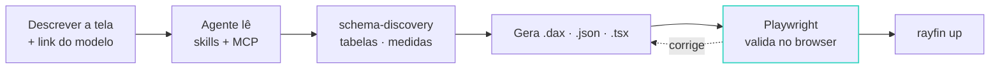

###### 05

# Feito para *agentes*

O Rayfin foi desenhado para ser lido e escrito por Copilot, Claude Code e afins — não só por pessoas.

05

<!--
Alvo: 00:38.
-->

---
layout: two-cols-header
---

# O repositório ensina o agente

::left::

- `AGENTS.md` descreve como o app está ligado; o CLI nunca o sobrescreve
- `.agents/skills/` traz **dez skills** gerenciadas, na versão instalada
- `.mcp.json` registra o **Rayfin MCP**: o agente consulta a doc da versão certa
- `npx rayfin docs search 'known limitations'` responde pelo pacote instalado, não pelo blog
- Plugin oficial **v0.4** (1 set): Claude Code, Copilot CLI, Codex, Cursor, Gemini CLI, Kimi, VS Code

::right::

<<< @/snippets/agents-tree.txt text {lines:false}

<!--
Alvo: 00:38:30.
Rayfin muda rápido e a doc é travada na versão instalada: `rayfin docs search`,
`rayfin docs get --symbol` e o servidor MCP respondem pelo que está no node_modules.
Na prática: o agente erra menos porque lê a doc certa, e você erra menos porque
pergunta para a mesma fonte.
O Universal App da galeria vai além: um "capability router" lê o que você pediu e
habilita só os serviços, pacotes e skills necessários.
-->

---

# O loop que funciona

- O link de compartilhamento do modelo já carrega workspace e item: é o único input que o agente precisa
- Humano decide **o quê** e revisa o PR; agente monta **como**, contra a doc da versão instalada

<!--
Alvo: 00:40.
A doc do template recomenda exatamente isto: "use meu modelo em <link> para gerar um
app de X". O passo Playwright é o que separa demo de produto: o agente abre o app,
confere que o visual renderizou, não cortou, sem erro no console.
Fim da seção: o SDK é a metade; o repositório que ensina o agente é a outra.
-->
